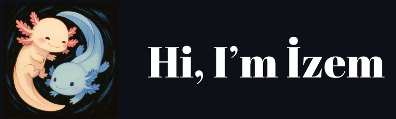
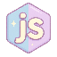
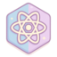

  <!-- Profil fotoğrafı, tema bazlı farklı resim gösterme -->
  <picture>
    
  </picture>
   
   
<picture>
    <source media="(prefers-color-scheme: dark)" srcset="https://github.com/user-attachments/assets/53014bb2-3129-4c1a-b20a-92142d8a30c5">
    <source media="(prefers-color-scheme: light)" srcset="https://github.com/user-attachments/assets/2ed69842-4b8a-4e31-8ce7-013f0c4e064c">
    
  </picture>
  

    I am a 20 year old programmer with an interest in Web and Game Development. 
    Currently experimenting with multiplayer systems, procedural design & AI integration.
  

  <!-- İkinci tema bazlı resim örneği -->
  <picture>
    <source media="(prefers-color-scheme: dark)" srcset="https://github.com/user-attachments/assets/53014bb2-3129-4c1a-b20a-92142d8a30c5">
    <source media="(prefers-color-scheme: light)" srcset="https://github.com/user-attachments/assets/2ed69842-4b8a-4e31-8ce7-013f0c4e064c">
    
  </picture>

  <h1>Languages</h1>
 
   
  
  
  
  
   
  <picture>
    <source media="(prefers-color-scheme: dark)" srcset="https://github.com/user-attachments/assets/53014bb2-3129-4c1a-b20a-92142d8a30c5">
    <source media="(prefers-color-scheme: light)" srcset="https://github.com/user-attachments/assets/2ed69842-4b8a-4e31-8ce7-013f0c4e064c">
    
  </picture> 
  
  
  
   
  <picture>
    <source media="(prefers-color-scheme: dark)" srcset="https://github.com/user-attachments/assets/53014bb2-3129-4c1a-b20a-92142d8a30c5">
    <source media="(prefers-color-scheme: light)" srcset="https://github.com/user-attachments/assets/2ed69842-4b8a-4e31-8ce7-013f0c4e064c">
    
  </picture>
   
  
  
  
  
  <h1>Projects</h1>
  
 

